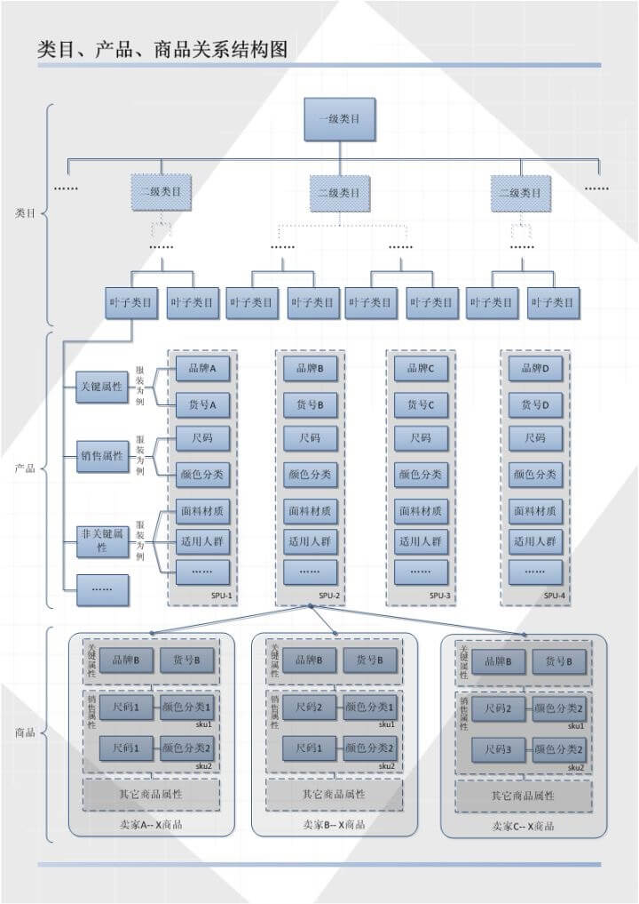
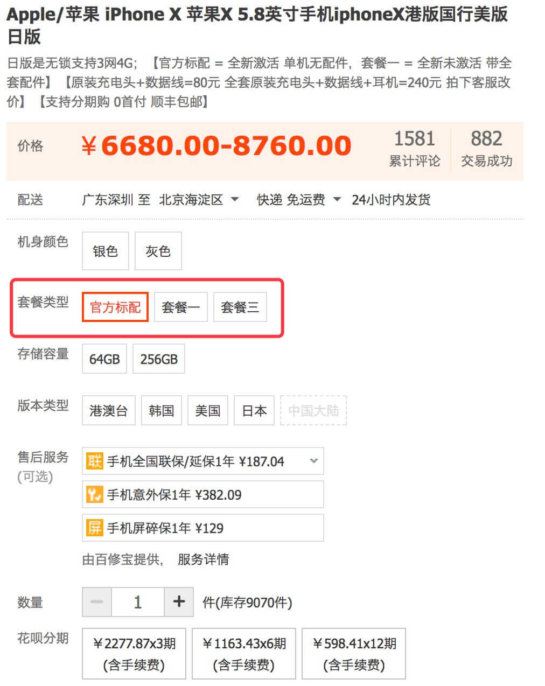
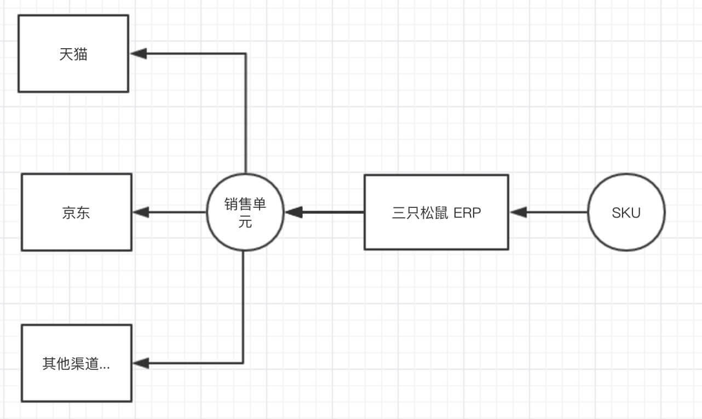
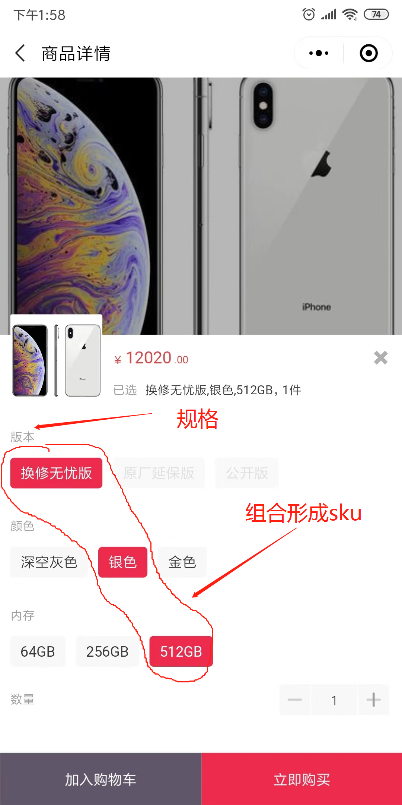
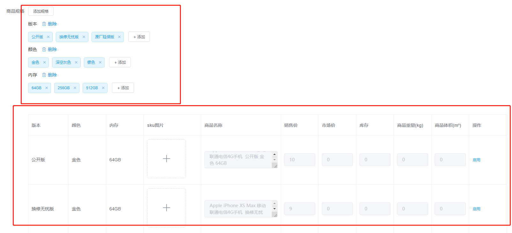
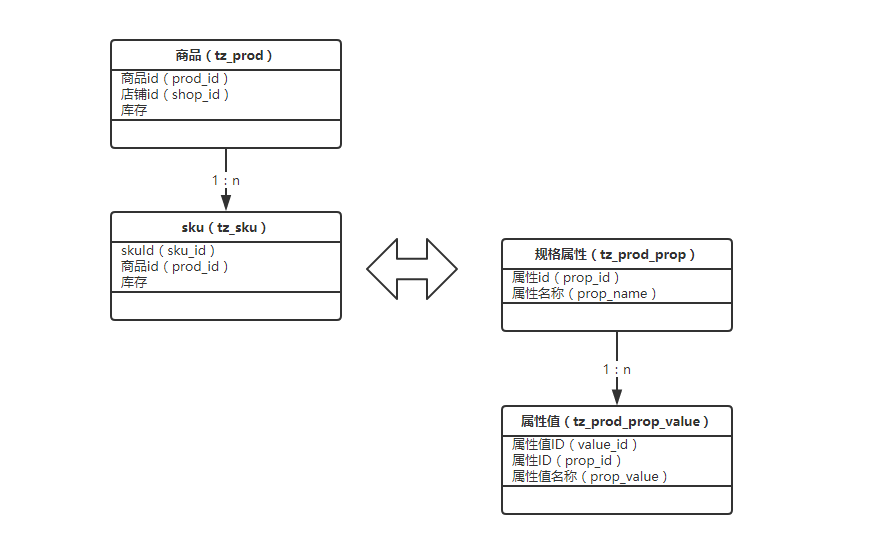
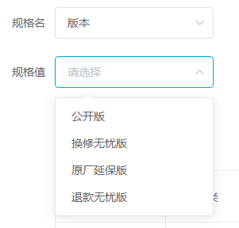
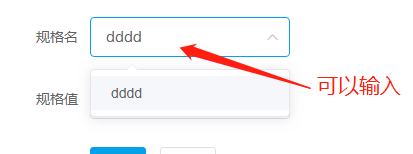

# 1. 背景了解

在看具体的数据库实体设计之前，我们先一起了解下**电商的名词定义**

## 1.1 名词定义

参考 [《产品 SKU 是什么意思？与之相关的还有哪些？》](https://www.zhihu.com/question/19841574) 整理。

**SKU：Stock Keeping Unit**

中文翻译为库存单位。SKU 从**库存**视角，以库存进出为单位，可以是件、瓶、箱等等。

例如，iPhone 手机，按照规格( 颜色 + 内存 )可以组合出如下多个 SKU ：

| SKU  | 颜色 | 内存 |
| ---- | ---- | ---- |
| A    | 白色 | 16G  |
| B    | 白色 | 64G  |
| C    | 黑色 | 16G  |
| D    | 黑色 | 64G  |

可以看出，颜色（白色、黑色）与内存（16G、64G）组合排列出四种 iPhone SKU。

**SPU：Standard Product Unit**

中文翻译为标准产品单位。SPU 从**产品**视角，是产品信息聚合的**最小单位**，是一组可复用、易检索的标准化信息的集合，该集合描述了一个产品的特性。通俗点讲，属性值、特性相同的商品就可以被称为一个 SPU 。例如 iPhone 8 就是一个 SPU ，iPhone 8 Plus 也是一个 SPU ，这个与**商家**无关，与颜色、款式、套餐等**规格**无关。

**商品**：

商家出售某个 SPU ，那么这就是一个商品。商品在 SPU 之上，增加了销售价格、促销活动、运费等等信息。另外，**一个商品可以包含多个 SKU**。

**总结**



------

现实的场景往往比定义复杂的多，在本文中，**SKU 代表销售的单元**。主要考虑如下两方面：

- 实际我们看到的商品详情页，购买的是一个**销售组合单元**。例如，很多商家会打包 【iPhone X ：银色-64G-套餐三】，其中套餐三为赠送贴膜 + 保护壳等等，当然价格上会更贵。这明显就违背了我们上述提到 SKU 库存的概念，已经变成了多个 SKU 的销售组合单元。
- 一个商家会在不同平台销售商品，例如三只松鼠，其在天猫、京东等等平台都有官方旗舰店，同时也供货给其他渠道商，那么实际关系会变成如下图所示： 通过这样的方式，三只松鼠在不同的平台，定义不同的价格，设置不同的促销信息等等个性化的运营。

------

**那么注意了**！！！
**下文开始，SKU 代表销售的单元**
**下文开始，SKU 代表销售的单元**
**下文开始，SKU 代表销售的单元**

## 1.2 界面

1. 商城端-购买页

   

2. 运营后台-商品发布页 

# 2. 数据库实体

整体实体类关系如下图：



全部实体可在数据库中查阅。

## 2.1 Product

Product 字段较多，我们进行简单的切块。

### 2.1.1 基础字段

```java
@Data
@TableName("TZ_PROD")
public class Product implements Serializable {

    /**
     * 商品ID
     */
    @TableId
    private Long prodId;

    /**
     * 店铺id
     */
    private Long shopId;

    /**
     * 商品名称
     */
    private String prodName;

    /**
     * 简要描述,卖点等
     */
    private String brief;

    /**
     * 商品主图
     */
    private String pic;

    /**
     * 商品图片
     */
    private String imgs;

    /**
     * 默认是1，表示正常状态, -1表示删除, 0下架
     */
    private Integer status;

    /**
     * 商品分类
     */
    private Long categoryId;

    /**
     * 已经销售数量
     */
    private Integer soldNum;

    /**
     * 录入时间
     */
    private Date createTime;

    /**
     * 修改时间
     */
    private Date updateTime;

    /**
     * 详细描述
     */
    private String content;

    /**
     * 上架时间
     */
    private Date putawayTime;


    @Data
    public static class DeliveryModeVO {

        /**
         * 用户自提
         */
        private Boolean hasUserPickUp;

        /**
         * 店铺配送
         */
        private Boolean hasShopDelivery;

    }
}
```

- `prodId` ，商品id，数据库自增。
- `shopId` ，店铺编号，支持多商户( 店铺 )。
- `categoryId` ，商品所在分类id，每个商品都有自己所属的分类


### 2.1.2 价格库存

```java

/**
 * 库存量
 * 基于 sku 的库存数量累加
 */
private Integer totalStocks;

/**
 * 原价
 */
private Double oriPrice;

/**
 * 现价
 */
private Double price;


```

- 在我们的数据库中规定，所有的商品都是具有sku的，就算是只有一种规格的商品，所以`product`里面的库存数量为所有sku库存数量的总和
- `price` ，商品价格为元，这里使用`Double`而没有使用`BigDecimal `，而数据库中使用`decimal` 进行存储，所以在数据库中是可以进行直接进行运算的，而在java当中需要使用`com.yami.shop.common.util.Arith`进行运算 。


### 2.1.3 运费信息

```java
    /**
     * 配送方式json
     */
    private String deliveryMode;

    /**
     * 运费模板id
     */
    private Long deliveryTemplateId;
    
    @Data
    public static class DeliveryModeVO {

        /**
         * 用户自提
         */
        private Boolean hasUserPickUp;

        /**
         * 店铺配送
         */
        private Boolean hasShopDelivery;

    }
```

- 根据` deliveryMode `标记所含有的配送方式进行配送。

- `deliveryTemplateId` 运费模板id，根据不同的运费模板设计不同的配送费

  

  运费模板的操作见 ：运费模板的设计相关文章。


## 2.2 Sku

商品 SKU 。


```java
@Data
@TableName("tz_sku")
public class Sku implements Serializable {
    /**
     * 单品ID
     */
    @TableId
    private Long skuId;

    /**
     * 商品ID
     */
    private Long prodId;

    /**
     * 销售属性组合字符串,格式是p1:v1;p2:v2
     */
    private String properties;

    /**
     * 原价
     */
    private Double oriPrice;

    /**
     * 价格
     */
    private Double price;

    /**
     * 库存
     */
    private Integer stocks;

    /**
     * 实际库存
     */
    private Integer actualStocks;

    /**
     * 修改时间
     */
    private Date updateTime;

    /**
     * 记录时间
     */
    private Date recTime;

    /**
     * 商家编码
     */
    private String partyCode;

    /**
     * 商品条形码
     */
    private String modelId;

    /**
     * sku图片
     */
    private String pic;

    /**
     * sku名称
     */
    private String skuName;

    /**
     * 商品名称
     */
    private String prodName;

    /**
     * 重量
     */
    private Double weight;

    /**
     * 体积
     */
    private Double volume;

    /**
     * 状态：0禁用 1 启用
     */
    private Integer status;

    /**
     * 0 正常 1 已被删除
     */
    private Integer isDelete;

}
```

- `skuId` ，SKU 编号，自增，唯一，参见分销场景。

- `prodId` ，商品编号，N：1 指向对应的 Product 。

- `status`，SKU 状态。编辑商品时，当禁用该sku时，前端将会将该sku置灰

- `stocks` ，库存数量。

- `properties`，商品规格，字符串拼接格式。

  绝大多数情况下，数据库里的该字段，不存在检索的需求，更多的时候，是查询整体记录，在内存中解析使用。

  少部分情况，灵活的检索，使用 Elasticsearch 进行解决。

  因为我们的规格是直接保存字符串的，所以可以选择，或直接输入

  


## 2.3 ProdProp

商品 SKU 规格属性，在数据库中保存的常用数据。不常用的数据可以直接手动输入即可。


```java
public class ProdProp implements Serializable {
    /**
     * 属性id
     */
    @TableId
    private Long propId;

    /**
     * 属性名称
     */
    private String propName;

    private Long shopId;
}

```

- `propId` ，属性编号。
- `propName` ，属性名称。


## 2.4 ProdPropValue

商品 SKU 规格属性，在数据库中保存的常用数据。

```java
public class ProdProp implements Serializable {
	/**
     * 属性值ID
     */
    @TableId
    private Long valueId;

    /**
     * 属性值名称
     */
    private String propValue;

    /**
     * 属性ID
     */
    private Long propId;
}

```

- `valueId` ，属性值ID。
- `propValue` ，属性值名称。
